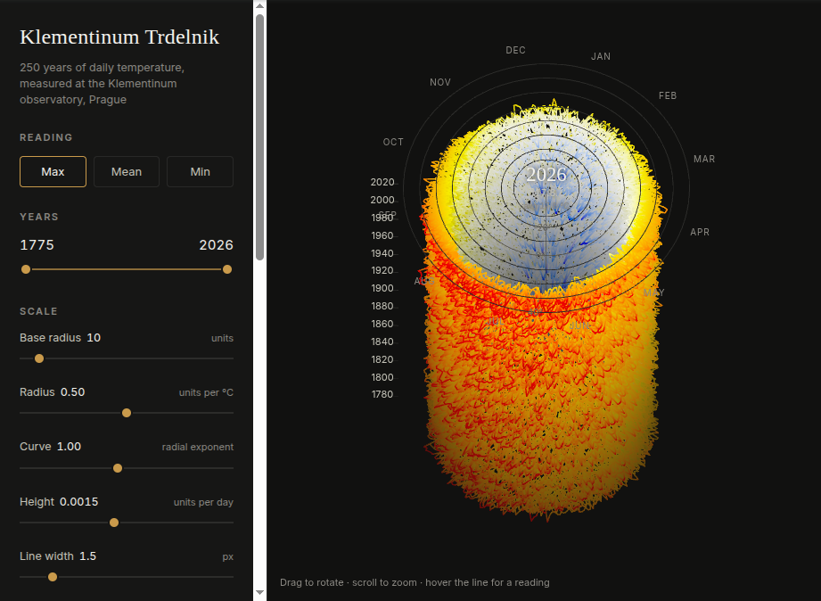
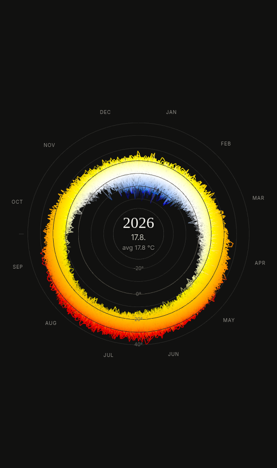
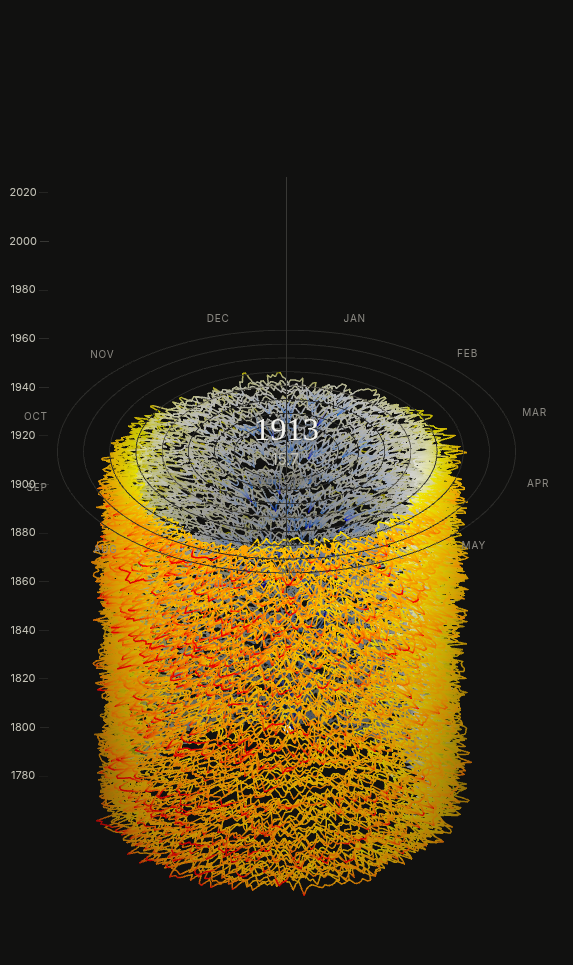

# Klementinum Trdelnik

Every daily temperature ever measured at the Klementinum observatory in Prague,
drawn as one continuous line in 3D. The observatory has recorded without a break
since 1 January 1775, which makes this one of the longest unbroken daily
temperature series in the world: **91,905 days** as of August 2026.

One turn of the coil is one calendar year. Height is time, oldest at the bottom.
Radius and colour are temperature, so a cold January pulls the line towards the
axis and a hot July throws it out to the rim.



The name is a joke about the shape. A *trdelník* is a Prague pastry rolled into a
hollow spiral tube, which is more or less what 250 years of weather looks like
from the side.

## What it shows

Read from above it is a seasonal clock: January at 12 o'clock, months running
clockwise, the winter side of the ring blue and the summer side red. Read from
the side it is a climate record, though a restrained one: two centuries of
warming move the radius by a couple of percent, which is what the Curve control
is for. Colour carries the trend much louder than shape does.

<p>
  
  
</p>

The right-hand figure is playback paused partway through, at 1913. Both images
came out of the app's own **Save as image** button.

Some things worth looking for once it is running:

- **1785, 1 March.** The coldest reading in the record, −27.6 °C, and the
  innermost point on the whole coil.
- **1850, 22 January.** The coldest *daytime max* ever, −21.5 °C, and a single
  vicious spike rather than a cold spell: −3.0 on the 20th, −21.5 on the 22nd,
  back to −2.4 by the 24th. On the coil it is one deep notch, three days wide.
- **2026, 28 June.** The hottest, 39.7 °C, right at the top.
- **Days warm faster than nights.** Comparing the first fifty years of the record
  with the last fifty, the mean daily maximum rose 1.9 °C (12.98 to 14.87) while
  the mean daily minimum rose 1.0 °C (6.55 to 7.53). Toggling Max against Min
  shows it: the hot side of the coil pushes outward about twice as far as the cold
  side retreats. Treat the magnitudes as a property of this one station, not a
  regional figure; a 250-year city-centre record carries siting and urban warming
  along with the climate.

## Run it

```sh
php -S localhost:8000 tools/router.php
# open http://localhost:8000
```

No build step and no package manager: plain ES modules, and three.js is vendored
in `vendor/` (see `vendor/README.md`). `tools/router.php` mirrors the hosting
setup and sends `Cache-Control: no-cache`, so a reload after an edit cannot mix
stale and fresh modules.

Any static server works too. PHP buys one thing only, the live data update
described below; without it the app just draws whatever is already in `data/`.
Opening `index.html` straight off disk does **not** work, because `fetch()` needs
http. Needs a browser with WebGL2.

## Controls

- **Reading**: daily Max / Mean / Min temperature. All three share one radius and
  colour mapping, anchored to the all-time extremes, so switching between them is
  a fair comparison rather than a rescale.
- **Years**: dual slider selecting the displayed range.
- **Scale**: base circle radius, radial units per °C, radial curve exponent
  (non-linear emphasis of extremes), vertical units per day, line width, and
  depth dim (a fog-like cue: segments farther from the view plane get dimmer).
- **Color**: linear gradient, or Exp to spend the colour resolution on extremes.
- **View**: Persp / Tele / Ortho projection; Top and Front presets; Fit reframes
  the current rotation; drag to rotate, scroll to zoom; Save as image writes the
  current view to a PNG, overlay labels included; Reset to defaults. Changing a
  control never moves the camera, so framing is always something you asked for.
- **Play**: grows the coil day by day. The speed slider is bidirectional, zero at
  the centre, forward right and reverse left. Pause holds the playhead where it
  is; Stop puts the whole coil back. Reaching either end of the range parks the
  playhead until the speed sign flips. A readout in the middle of the spiral
  shows the year, date and that year's average, sized to fit the hole.
- Hover the line for an exact date and reading. Bulbs mark the two ends of the
  drawn coil, and the upper one rides the playhead during playback.

## The data

Daily max, mean and min for station **0-203-0-11514** (Praha-Klementinum), from
[ČHMÚ open data](https://opendata.chmi.cz/meteorology/climate/historical_csv/data/daily/temperature/),
published under [CC BY 4.0](https://creativecommons.org/licenses/by/4.0/).

| | |
| --- | --- |
| Range | 1775-01-01 to present |
| Days | 91,905 |
| Coldest | −27.6 °C, 1 March 1785 (daily min) |
| Hottest | 39.7 °C, 28 June 2026 (daily max) |
| Missing values | none |

Each element ships as `data/<key>.i16`: little-endian int16, temperature × 10,
`-32768` for missing, one value per day on a shared continuous day grid. That is
184 KB per element for 250 years, which the browser turns into a `Float32Array`
in a single pass. `data/meta.json` carries the grid bounds and the per-element
extremes the app needs before it can pick its anchors.

## Data updates

The historical CSVs stop at the end of the last full year; the running year comes
from the ČHMÚ "recent" feed. `src/data.js` starts `api/refresh.php` alongside the
first paint rather than ahead of it, so the page draws immediately and folds the
result in when the server has finished merging. The footer reports the day the
data runs through, and how many days the load added.

The update is cheap on both ends. It never re-reads the historical CSVs, only the
feed months after `meta.hist_end`, and each of those is a conditional GET that
answers 304 when ČHMÚ has published nothing new. New days are appended to the
binary grid, and files are rewritten only when a value actually changed. A check
takes about 0.15 s and is throttled to one per five minutes. The throttle is
stamped before the outbound request rather than after, so a ČHMÚ outage backs off
instead of re-issuing the whole batch on every page hit.

The same update runs standalone, for cron or after a long offline spell:

```sh
php tools/refresh.php           # --force to ignore the throttle
```

`?force=1` deliberately does nothing on the HTTP endpoint: forcing skips the
throttle, and one outbound fetch per hit would make a public amplifier.

To rebuild the historical base, which ČHMÚ republishes about once a year:

```sh
base=https://opendata.chmi.cz/meteorology/climate/historical_csv/data/daily/temperature
for f in TMA T TMI; do
  curl -o data/raw/dly-0-203-0-11514-$f.csv $base/dly-0-203-0-11514-$f.csv
done
python3 tools/prepare_data.py    # CSVs only: the grid ends at the last full year
php tools/refresh.php            # appends the running year from the feed
```

The rebuild is a local job (Python, 28 MB of CSVs, not in this repo); hosting only
ever runs the tail update. Afterwards, upload `data/*.i16` and `data/meta.json`.

## Publish on PHP hosting

Upload everything except `data/raw/`, `docs/` and `tools/`. Then:

1. make `data/` writable by the PHP user (`chmod 775 data`, or 777 on hosts where
   PHP and FTP run as different users)
2. optionally run `api/diag.php`: it reports the PHP version, curl/openssl, whether
   `data/` is writable, and whether the ČHMÚ feed is reachable from the host. It
   answers 404 to the web until you set `DIAG_KEY` inside the file and request
   `api/diag.php?key=<that value>`; `php api/diag.php` from a shell needs no key.
   Clear `DIAG_KEY` again when you are done.
3. if the host has cron, `php tools/refresh.php` every 30 minutes keeps `data/`
   warm even when nobody opens the page. Optional, since page loads do the same
   work.

`.htaccess` sets `DirectoryIndex index.html`, since some hosts only index
`index.php` and this app has none. On a host that ignores `.htaccess`, add a
one-line `index.php` instead:

```php
<?php readfile(__DIR__ . '/index.html');
```

Needs PHP 7.4+ with curl (or `allow_url_fopen`) and outbound HTTPS. If the host
blocks outbound connections the app still runs, and the footer says the live
update is unavailable.

## Layout

```
index.html              markup, import map, icon links
style.css
src/app.js              renderer, camera, playback, picking, PNG export
src/spiral.js           the geometry: radius mapping, colours, positions
src/colors.js           OKLab temperature ramp
src/data.js             loads meta + the int16 grids, builds the day grid
src/ui.js               panel controls
api/chmi.php            conditional GETs against the ČHMÚ recent feed
api/update.php          tail merge into data/*.i16 and meta.json
api/refresh.php         the endpoint the page calls
api/diag.php            host capability probe, closed by default
tools/prepare_data.py   CSVs to int16 grids (local, run rarely)
tools/make_favicon.py   icons, coloured from the data itself
tools/router.php        dev server with no-cache headers
tools/dev-browser.sh    Chromium with per-domain 3D blocking disabled
vendor/                 three.js r180, MIT, locally patched (see its README)
```

The icon is generated, not drawn. `tools/make_favicon.py` reads `data/` and
colours two rings by what each day of the year has actually recorded in 250
years, the outer ring by its record high and the inner by its record low, through
the same OKLab ramp the coil uses.

## Reloading during development

WebGL pages are hostile to reload-heavy work. Chromium keeps roughly 16 live
contexts browser-wide and drops the oldest, and it blocks a site from creating GPU
contexts for a few seconds whenever it attributes context losses to it, so a burst
of reloads ends in "the browser is refusing a WebGL context for this page".

The app handles that rather than dead-ending: it retries context creation with a
backoff, hands the context back on unload instead of waiting for garbage
collection, keeps the context when the page goes into the back/forward cache,
recovers by itself when the browser restores an evicted context, and shows a Retry
button if it still cannot start. To take the blocking out of the picture entirely:

```sh
tools/dev-browser.sh    # Chromium family, throwaway profile,
                        # --disable-domain-blocking-for-3d-apis
```

Firefox does no per-domain 3D blocking, so it is a fine dev browser too. `?dpr=1`
renders one device pixel per CSS pixel, which lightens GPU memory if contexts keep
dying. `chrome://gpu` says whether the driver is the problem; `chrome://restart`
clears a wedged GPU process.

`PLAN.md` has the design notes: why the radius mapping is anchored the way it is,
how the fog window is derived, and what was tried and rejected.

## Credits

Measurements by [ČHMÚ](https://www.chmi.cz/), the Czech Hydrometeorological
Institute, from the Klementinum observatory, published as open data under CC BY
4.0. Rendering with [three.js](https://threejs.org/) (MIT).
